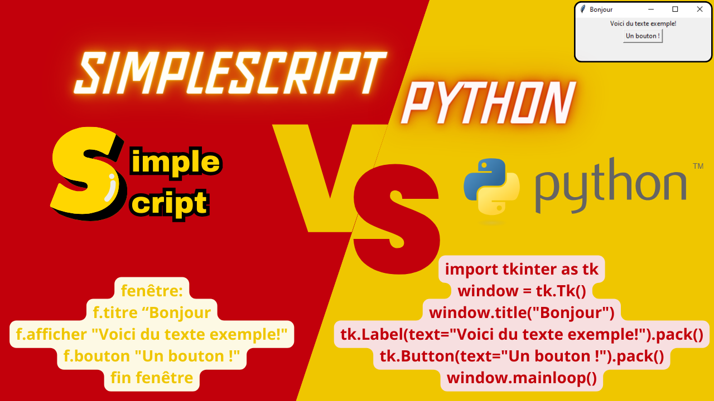

# Accueil - SimpleScript

SimpleScript est un projet novateur qui vise à créer un langage de programmation ultra-simple, accompagné de son propre environnement de développement intégré (IDE), pour rendre la programmation accessible à un public aussi large que possible. Voici quelques éléments clés de ce projet :

1. **Simplicité avant tout** : SimpleScript se distingue par sa simplicité. Le langage est conçu pour être facile à comprendre, avec une syntaxe minimale et des concepts de programmation abordables même pour les débutants absolus. Cette approche permet à ceux qui n'ont aucune expérience préalable en programmation de commencer à écrire du code rapidement et efficacement.
2. **IDE dédié** : En plus du langage lui-même, le projet comprend également le développement d'un environnement de développement intégré (IDE) spécialement conçu pour travailler avec SimpleScript. Cet IDE offre des fonctionnalités telles que la coloration syntaxique, l'auto-complétion, le débogage en temps réel et d'autres outils qui facilitent la création, le test et le débogage de programmes SimpleScript.
3. **Accessibilité** : SimpleScript vise à abattre les barrières à l'entrée dans le monde de la programmation. En rendant le langage et l'IDE conviviaux et faciles à utiliser, le projet ouvre la voie à un public plus large, y compris les enfants, les étudiants, les amateurs de technologie et les professionnels de tous horizons.
4. **Évolutivité et collaboration** : Bien que SimpleScript soit simple par conception, il est également évolutif. Le projet est conçu pour évoluer avec le temps grâce à la contribution de développeurs du monde entier. En publiant le projet sur GitHub, l'équipe derrière SimpleScript encourage la collaboration et l'innovation continue, permettant au langage de s'enrichir de nouvelles fonctionnalités et de s'adapter aux besoins changeants de sa communauté d'utilisateurs.
[Voir la documentation ici](Documentation)

En résumé, SimpleScript représente une vision ambitieuse de la programmation simplifiée, offrant un point de départ idéal pour les débutants tout en restant suffisamment puissant pour les projets plus avancés. En combinant la simplicité du langage avec un IDE convivial et un engagement envers la collaboration communautaire, le projet aspire à devenir un catalyseur pour l'apprentissage et l'innovation dans le domaine de la programmation.
